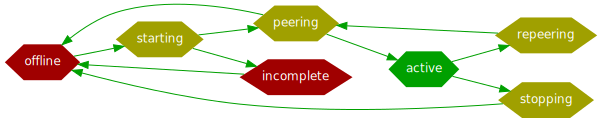

[Documentation](../../README.md#documentation) → Usage → Administration

-----

[Читать на русском](admin.ru.md)

# Administration

- [Pool states](#pool-states)
- [PG states](#pg-states)
  - [Base PG states](#base-pg-states)
  - [Additional PG states](#additional-pg-states)
- [Removing a healthy disk](#removing-a-healthy-disk)
- [Removing a failed disk](#removing-a-failed-disk)
- [Adding a disk](#adding-a-disk)
- [Restoring from lost pool configuration](#restoring-from-lost-pool-configuration)
- [Incompatibility problems](#Incompatibility-problems)
- [Upgrading Vitastor](#upgrading-vitastor)
- [OSD memory usage](#osd-memory-usage)

## Pool states

Pool is active — that is, fully available for client input/output — when all its PGs are
'active' (maybe with some additional state flags).

If at least 1 PG is inactive, pool is also inactive and all clients suspend their I/O and
wait until you fix the cluster. :-)

## PG states

PG states may be seen in [vitastor-cli status](cli.en.md#status) output.

PG state consists of exactly 1 base state and an arbitrary number of additional states.

### Base PG states

PG state always includes exactly 1 of the following base states:
- **active** — PG is active and handles user I/O.
- **incomplete** — Not enough OSDs are available to activate this PG. More exactly, that
  means one of the following:
  - Less than pg_minsize current target OSDs are available for the PG. I.e. more disks
    are lost than allowed by the pool's redundancy scheme.
  - All OSDs of some of PG's history records are unavailable, or, for EC pools, less
    than (pg_size-parity_chunks) OSDs are available in one of the history records.
    In other words it means that some data in this PG was written to an OSD set such that
    it's currently impossible to read it back because these OSDs are down. For example,
    if the pool has pg_size=3 and pg_minsize=1, part of the data may be written only to
    1 OSD. If that exact OSD is lost, PG becomes **incomplete**.
  - [allow_net_split](../config/osd.en.md#allow_net_split) is disabled (default) and
    primary OSD of the PG can't connect to some secondary OSDs marked as alive in etcd.
    I.e. a network partition happened: OSDs can talk to etcd, but not to some other OSDs.
- **offline** — PG isn't activated by any OSD at all. Either primary OSD isn't set for
  this PG at all (if the pool is just created), or an unavailable OSD is set as primary,
  or the primary OSD refuses to start this PG (for example, because of wrong block_size),
  or the PG is stopped by the monitor using `pause: true` flag in `/vitastor/pg/config` in etcd.
- **starting** — primary OSD has acquired PG lock in etcd, PG is starting.
- **peering** — primary OSD requests PG object listings from secondary OSDs and calculates
  the PG state.
- **repeering** — PG is waiting for current I/O operations to complete and will
  then transition to **peering**.
- **stopping** — PG is waiting for current I/O operations to complete and will
  then transition to **offline** or be activated by another OSD.

All states except **active** mean that PG is inactive and client I/O is suspended.

**peering** state is normally visible only for a short period of time during OSD restarts
and during switching primary OSD of PGs.

**starting**, **repeering**, **stopping** states normally almost aren't visible at all.
If you notice them for any noticeable time — chances are some operations on some OSDs hung.
Check `vitastor-cli status` and search for "slow op" in OSD logs to find them — operations
hung for more than [slow_log_interval](../config/osd.en.md#slow_log_interval) are logged as
"slow ops" and displayed in `status`.

State transition diagram:



### Additional PG states

If a PG is active it can also have any number of the following additional states:

- **degraded** — PG is running on reduced number of drives (OSDs), redundancy of all
  objects in this PG is reduced.
- **has_incomplete** — some objects in this PG are incomplete (unrecoverable), that is,
  they have too many lost EC parts (more than pool's [parity_chunks](../config/pool.en.md#parity_chunks)).
- **has_degraded** — some objects in this PG have reduced redundancy
  compared to the rest of the PG (so PG can be degraded+has_degraded at the same time).
  These objects should be healed automatically by recovery process, unless
  it's disabled by [no_recovery](../config/osd.en.md#no_recovery).
- **has_misplaced** — some objects in this PG are stored on an OSD set different from
  the target set of the PG. These objects should be moved automatically, unless
  rebalance is disabled by [no_rebalance](../config/osd.en.md#no_rebalance). Objects
  that are degraded and misplaced at the same time are treated as just degraded.
- **has_unclean** — one more state normally noticeable only for very short time during
  PG activation. It's used only with EC pools and means that some objects of this PG
  have started but not finished modifications. All such objects are either quickly
  committed or rolled back by the primary OSD when starting the PG, that is why the
  state shouldn't be noticeable. If you notice it, it probably means that commit or
  rollback operations are hung.
- **has_invalid** — PG contains objects with incorrect part ID. Never occurs normally.
  It can only occur if you delete a non-empty EC pool and then recreate it as a replica
  pool or with smaller data part count.
- **has_corrupted** — PG has corrupted objects, discovered by checking checksums during
  read or during scrub. When possible, such objects should be recovered automatically.
  If objects remain corrupted, use [vitastor-cli describe](cli.en.md#describe) to find
  out details and/or look into the log of the primary OSD of the PG.
- **has_inconsistent** — PG has objects with non-matching parts or copies on different OSDs,
  and it's impossible to determine which copy is correct automatically. It may happen
  if you use a pool with 2 replica and you don't enable checksums, and if data on one
  of replicas becomes corrupted. You should also use vitastor-cli [describe](cli.en.md#describe)
  and [fix](cli.en.md#fix) commands to remove the incorrect version in this case.
- **left_on_dead** — part of the data of this PG is left on unavailable OSD that isn't
  fully removed from the cluster. You should either start the corresponding OSD back and
  let it remove the unneeded data or remove it from cluster using vitastor-cli
  [rm-osd](cli.en.md#rm-osd) if you know that it's gone forever (for example, if the disk died).
- **scrubbing** — data [scrub](../config/osd.en.md#auto_scrub) is running for this PG.

## Removing a healthy disk

Before removing a healthy disk from the cluster set its OSD weight(s) to 0 to
move data away. To do that, run `vitastor-cli modify-osd --reweight 0 <НОМЕР_OSD>`.

Then wait until rebalance finishes and remove OSD by running `vitastor-disk purge /dev/vitastor/osdN-data`.

Zero weight can also be put manually into etcd key `/vitastor/config/osd/<НОМЕР_OSD>`, for example:

```
etcdctl --endpoints=http://1.1.1.1:2379/v3 put /vitastor/config/osd/1 '{"reweight":0}'
```

## Removing a failed disk

If a disk is already dead, its OSD(s) are likely already stopped.

In this case just remove OSD(s) from the cluster by running `vitastor-cli rm-osd OSD_NUMBER`.

## Adding a disk

If you're adding a server, first install Vitastor packages and copy the
`/etc/vitastor/vitastor.conf` configuration file to it.

After that you can just run `vitastor-disk prepare /dev/nvmeXXX`, of course with
the same parameters which you used for other OSDs in your cluster before.

## Restoring from lost pool configuration

If you remove or corrupt `/vitastor/config/pools` key in etcd all pools will
be deleted. Don't worry, the data won't be lost, but you'll need to perform
a specific recovery procedure.

First you need to restore previous configuration of the pool with the same ID
and EC/replica parameters and wait until pool PGs appear in `vitastor-cli status`.

Then add all OSDs into the history records of all PGs. You can do it by running
the following script (just don't forget to use your own PG_COUNT and POOL_ID):

```
PG_COUNT=32
POOL_ID=1
ALL_OSDS=$(etcdctl --endpoints=your_etcd_address:2379 get --keys-only --prefix /vitastor/osd/stats/ | \
    perl -e '$/ = undef; $a = <>; $a =~ s/\s*$//; $a =~ s!/vitastor/osd/stats/!!g; $a =~ s/\s+/,/g; print $a')
for i in $(seq 1 $PG_COUNT); do
    etcdctl --endpoints=your_etcd_address:2379 put /vitastor/pg/history/$POOL_ID/$i '{"all_peers":['$ALL_OSDS']}'
done
```

After that all PGs should peer and find all previous data.

## Incompatibility problems

### ISA-L 2.31

⚠ It is FORBIDDEN to use Vitastor 2.1.0 and earlier versions with ISA-L 2.31 and newer if
you use EC N+K pools and K > 1 on a CPU with GF-NI instruction support, because it WILL
lead to **data loss** during EC recovery.

If you accidentally upgraded ISA-L to 2.31 but didn't upgrade Vitastor and restarted OSDs,
then stop them as soon as possible and either update Vitastor or roll back ISA-L.

## Upgrading Vitastor

Every upcoming Vitastor version is usually compatible with previous both forward
and backward regarding the network protocol and etcd data structures.

So, by default, if this page doesn't contain explicit different instructions, you
can upgrade your Vitastor cluster by simply upgrading packages and restarting all
OSDs and monitors in any order.

Upgrading is performed without stopping clients (VMs/containers), you just need to
upgrade and restart servers one by one. However, ideally you should restart VMs too
to make them use the new version of the client library.

### 1.7.x to 1.8.0

It's recommended to upgrade from version <= 1.7.x to version >= 1.8.0 with full downtime,
i.e. you should first stop clients and then the cluster (OSDs and monitor), because 1.8.0
includes a fix for etcd event stream inconsistency which could lead to "incomplete" objects
appearing in EC pools, and in rare cases, probably, even to data corruption during mass OSD
restarts. It doesn't mean that you WILL hit this problem if you upgrade without full downtime,
but it's better to secure yourself against it.

Also, if you upgrade version from <= 1.7.x to version >= 1.8.0, BUT <= 1.9.0: restart all clients
(VMs and so on), otherwise they will hang when monitor clears old PG configuration key,
which happens 24 hours after upgrade.

This is fixed in 1.9.1. So, after upgrading version <= 1.7.x directly to version >= 1.9.1,
you DO NOT have to restart all old clients immediately - they will work like before until
you decide to upgrade them too. The downside is that you'll have to remove the old PG
configuration key (`/vitastor/config/pgs`) from etcd by hand when you make sure that all
your clients are restarted.

### 1.1.x to 1.2.0

Upgrading version <= 1.1.x to version >= 1.2.0, if you use EC n+k with k>=2, is recommended
to be performed with full downtime: first you should stop all clients, then all OSDs,
then upgrade and start everything back — because versions before 1.2.0 have several
bugs leading to invalid data being read in EC n+k, k>=2 configurations in degraded pools.

### 0.8.7 to 0.9.0

Versions <= 0.8.7 are incompatible with versions >= 0.9.0, so you should first
upgrade from <= 0.8.7 to 0.8.8 or 0.8.9, and only then to >= 0.9.x. If you upgrade
without this intermediate step, client I/O will hang until the end of upgrade process.

### 0.5.x to 0.6.x

Upgrading from <= 0.5.x to >= 0.6.x is not supported.

## Downgrade

Downgrade are also allowed freely, except the following specific instructions:

### 1.8.0 to 1.7.1

Before downgrading from version >= 1.8.0 to version <= 1.7.1
you have to copy /vitastor/pg/config etcd key to /vitastor/config/pgs:

```
etcdctl --endpoints=http://... get --print-value-only /vitastor/pg/config | \
  etcdctl --endpoints=http://... put /vitastor/config/pgs
```

Then you can just install older packages and restart all services.

If you performed downgrade without first copying that key, run "add all OSDs into the
history records of all PGs" from [Restoring from lost pool configuration](#restoring-from-lost-pool-configuration).

### 1.0.0 to 0.9.x

Version 1.0.0 has a new disk format, so OSDs initialized on 1.0.0 or later can't
be rolled back to 0.9.x or previous versions.

### 0.8.0 to 0.7.x

Versions before 0.8.0 don't have vitastor-disk, so OSDs, initialized by it, won't
start with older versions (0.4.x - 0.7.x). :-)

## OSD memory usage

OSD uses RAM mainly for:

- Metadata index: `data_size`/[`block_size`](../config/layout-cluster.en.md#block_size) * `approximately 1.1` * `32` bytes.
  Consumed always.
- Copy of the on-disk metadata area: `data_size`/[`block_size`](../config/layout-cluster.en.md#block_size) * `28` bytes.
  Consumed if [inmemory_metadata](../config/osd.en.md#inmemory_metadata) isn't disabled.
- Bitmaps: `data_size`/[`bitmap_granularity`](../config/layout-cluster.en.md#bitmap_granularity)/`8` * `2` bytes.
  Consumed always.
- Journal index: between 0 and, approximately, journal size. Consumed always.
- Copy of the on-disk journal area: exactly journal size. Consumed if
  [inmemory_journal](../config/osd.en.md#inmemory_journal) isn't disabled.
- Checksums: `data_size`/[`csum_block_size`](../config/osd.en.md#csum_block_size) * 4 bytes.
  Consumed if checksums are enabled and [inmemory_metadata](../config/osd.en.md#inmemory_metadata) isn't disabled.

bitmap_granularity is almost always 4 KB.

So with default SSD settings (block_size=128k, journal_size=32M, csum_block_size=4k) memory usage is:

- Metadata and bitmaps: ~600 MB per 1 TB of data.
- Journal: up to 64 MB per 1 OSD.
- Checksums: 1 GB per 1 TB of data.

With default HDD settings (block_size=1M, journal_size=128M, csum_block_size=32k):

- Metadata and bitmaps: ~128 MB per 1 TB of data.
- Journal: up to 256 MB per 1 OSD.
- Checksums: 128 MB per 1 TB of data.
